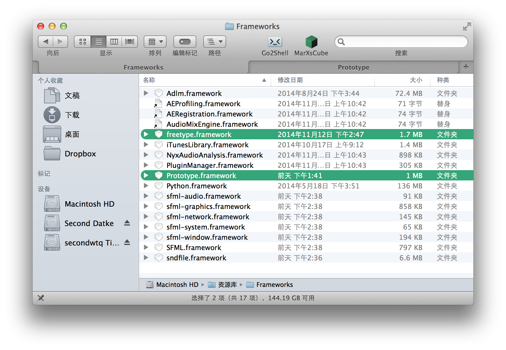
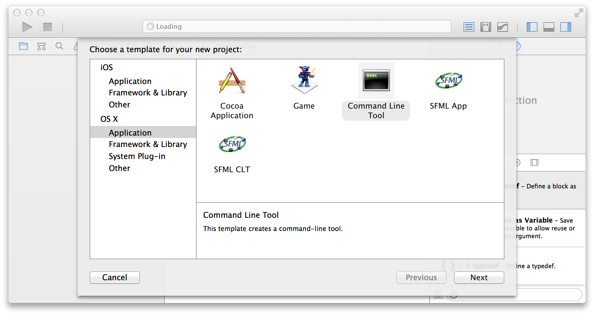
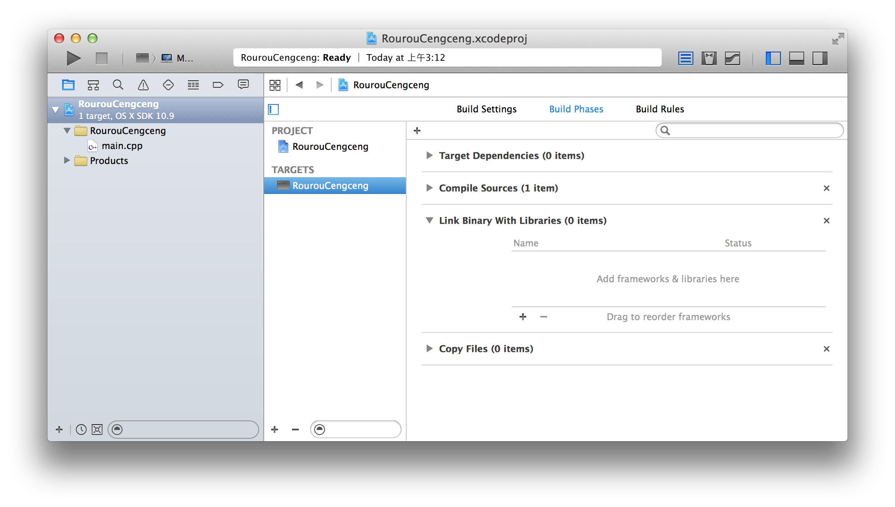
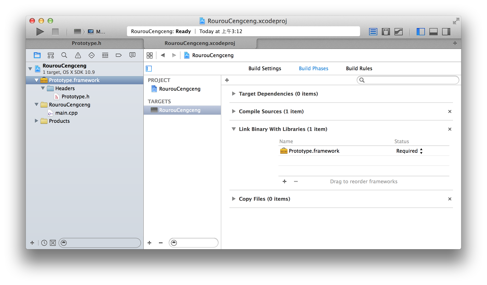

#Project 2048 Documentation#
####Prototype 框架参考####

---

##图形库框架的环境搭建##

目前为止，自带的 Prototype 框架在 Windows 和 OS X 下各提供了一个发行版：

* Windows 版：目前只适用于 mingw32-4.7.2 版本（该版本可以在包中的 _Dev-Cpp 5.5.3 MinGW 4.7.2 Portable.7z_ 找到）。

    对于暂时不会用/不想用 GCC/mingw 的同学，我们也有 Visual Studio 2013 的适配计划。
    
* OS X 版。适用于 OSX 10.9 Mavericks 或更高版本的 OS X。建议使用 6.1 或更高版本的 Xcode 进行开发。

    在 OS X 下安装框架并将其包含到 Xcode 工程中的方法：
    
    1. 将 Prototype 文件夹中的 Prototype.framework 和 freetype.framework 复制到 /Library/Frameworks 文件夹下。
    
        
    
    2. 打开 Xcode，创建一个新的 Command Line Tool 工程。

        
        
    3. 打开工程属性，选择 TARGETS 下面的项，在右边的 Build Phases 中，展开 Link Binary With Libraries。
    
        
        
    4. 点击左下角的加号，在弹出的模态对话框中点击 Add Other...，把 /Library/Frameworks 文件夹吓得 Prototype.framework 加入进来。这时可以看到在左边的工程浏览器中出现了这个 framework，并且可以看到它的头文件。
    
        
        
    5. 这时就可以写代码测试了。注意在调用框架的提供函数之前，要使用 `#include <Prototype/Prototype.h>` 把框架的头文件包含进来。
    
---

##绘图功能##

本部分主要聚焦于上一部分的第 4 点，即绘图部分，绘图部分又主要由两个函数来完成，即 `p_graphic_draw_rectangle()` 和 `p_graphic_draw_text()`，分别用于绘制矩形和绘制文本。

* `p_graphic_draw_rectangle()` 函数。

* `p_graphic_draw_text()` 函数。

---
[SCU ISDC](http://www.scuisdc.com) 2014